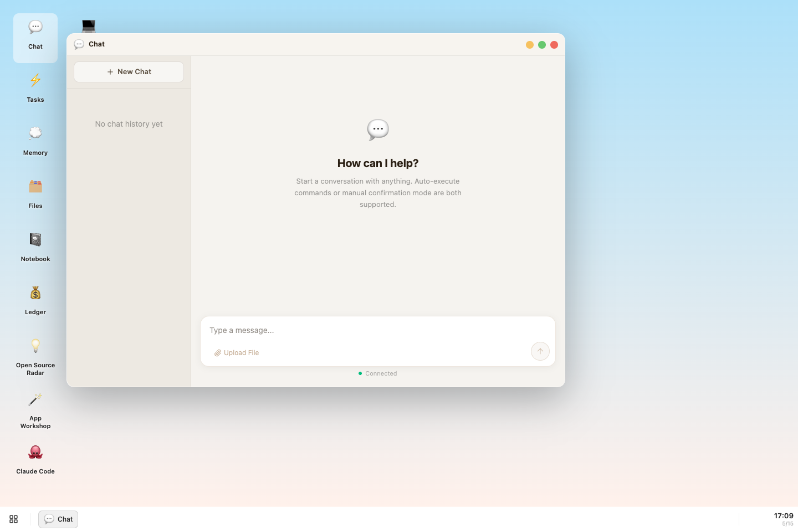
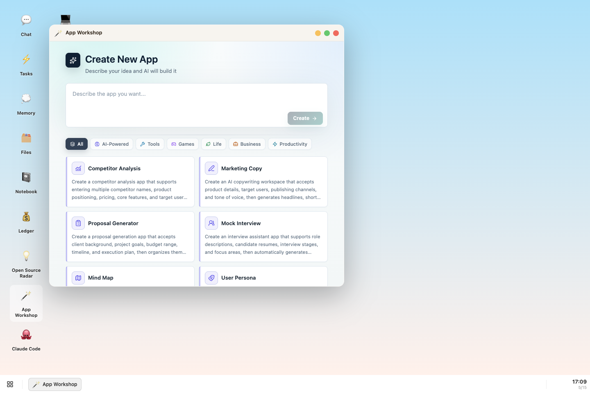
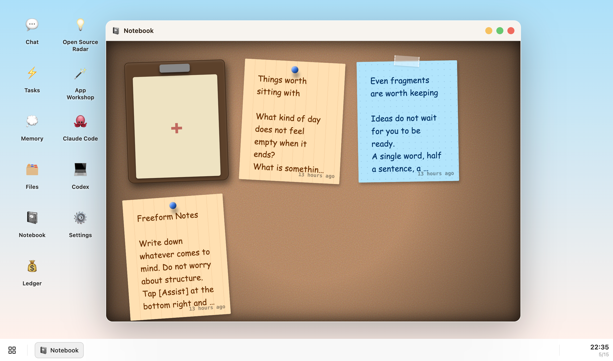
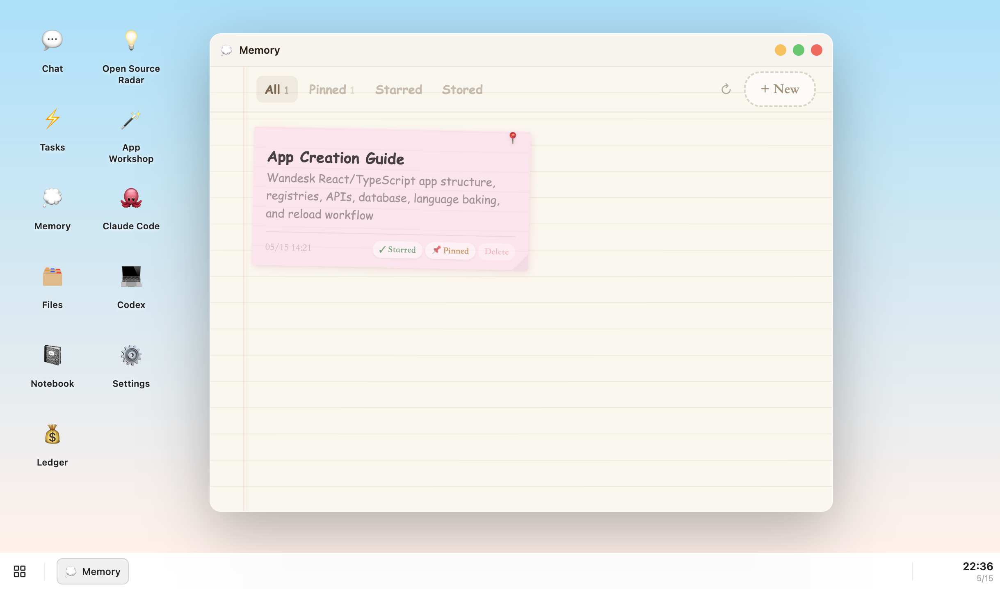
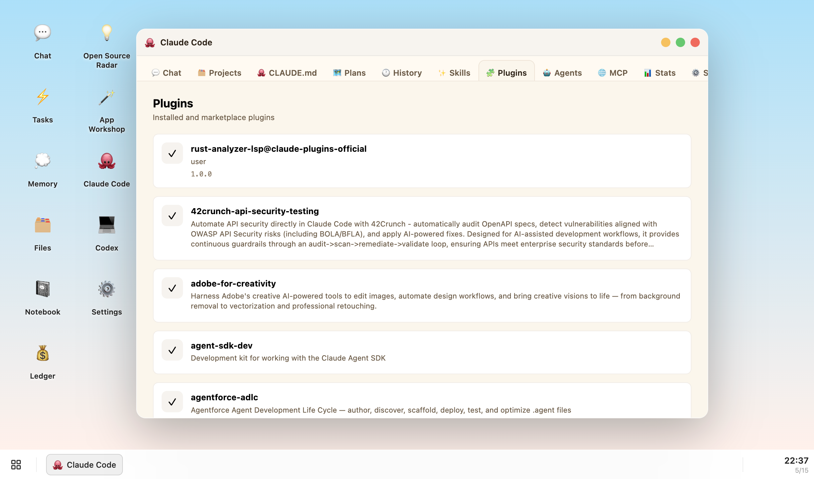
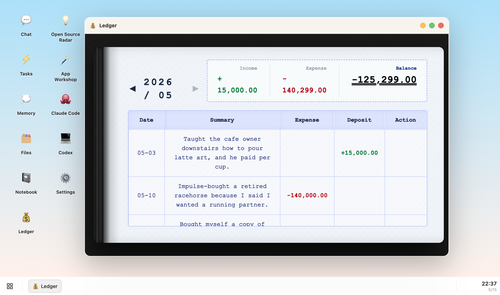
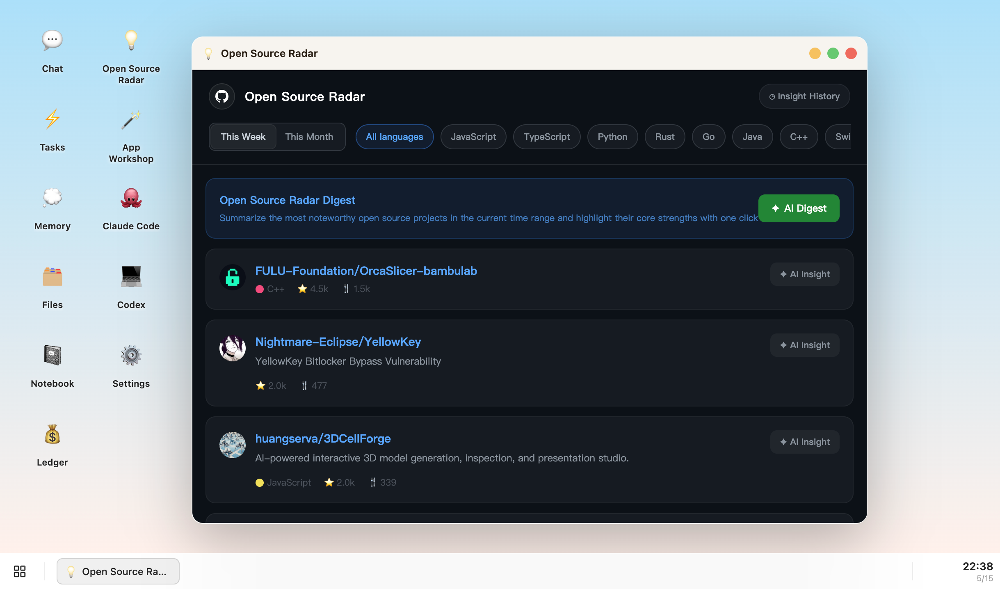

# Wandesk

[English](README.md) | [中文](README.zh-CN.md)

**Wandesk is an open-source AI desktop and local workbench.**

It is built around a simple idea: AI should not only live in chat. People still need apps, windows, files, memory, tables, notebooks, and workspaces. Wandesk brings those shapes together so AI can chat, use apps, build apps, and help apps talk back to AI.

## Screenshots

### Chat



Chat is the intent layer of the desktop. It can use local context, inspect the workspace, call tools, and coordinate work with the rest of the system.

### App Workshop



App Workshop turns an app idea into a concrete build request. Pick a template, describe the workflow, and let AI start creating the local app.

### Notebook



Notebook keeps lightweight notes in a visual app instead of burying them inside a conversation thread. Notes can become context for later AI work.

### Memory



Memory stores reusable long-term context for AI. Built-in memories can explain how Wandesk apps are structured, and users can add their own persistent preferences or facts.

### Claude Code Workbench



Claude Code is presented as a desktop app with tabs for chat, projects, memory files, plans, history, skills, plugins, agents, MCP, stats, settings, and account state.

### Ledger



Ledger is a local-first finance app. It shows how Wandesk can host ordinary GUI tools with their own data model, not just AI chat views.

### Open Source Radar



Open Source Radar tracks trending GitHub projects and can ask AI to summarize or analyze selected repositories.

## What Wandesk Does

- 💬 **Chat with AI** while keeping local workspace context available.
- 🪟 **Run real apps** in desktop-style windows with a launcher and taskbar.
- 🧠 **Store memory** so AI can remember stable facts, preferences, and system guidance.
- 🪄 **Create new apps** by letting AI write React UI, TypeScript backend APIs, SQLite storage, and `APP.md` docs.
- 🔁 **Let apps call AI** through task APIs for summaries, analysis, rewriting, coding, and longer agent work.
- 🛠️ **Use agent workbenches** such as Claude Code and Codex inside the same desktop.

## Why Apps Still Matter

Conversation is useful, but it should not replace every interface.

A notebook should look like a notebook. A finance record should stay editable in a table. A coding agent needs projects, history, settings, memory files, and logs. Wandesk treats chat and GUI as complementary: chat expresses intent, apps hold workflows, and AI moves between them.

## App Creation

Wandesk apps are local, inspectable, and editable. A new app usually touches:

```text
gui/src/apps/<app>/          React UI
server/apps/<app>/           API, service, repository
language/<lang>/apps/<app>/  APP.md source
apps/<app>/APP.md            baked runtime app context
database/apps/<app>.db       runtime SQLite data
```

The goal is not a disposable generated page. The goal is a real local app that can keep evolving through future AI sessions.

## Tech Stack

- React 19
- TypeScript
- Vite
- Tailwind CSS
- Node.js backend APIs
- SQLite via `better-sqlite3`
- WebSocket runtime channel

## Install

Prerequisites: Git, Node.js 20+, and npm.

macOS:

```bash
curl -fsSL https://raw.githubusercontent.com/Sider-ai/wandesk/main/install-macos.sh | sh
```

Linux:

```bash
curl -fsSL https://raw.githubusercontent.com/Sider-ai/wandesk/main/install-linux.sh | sh
```

Windows PowerShell:

```powershell
powershell -ExecutionPolicy Bypass -Command "irm https://raw.githubusercontent.com/Sider-ai/wandesk/main/install-windows.ps1 | iex"
```

## Project Layout

```text
gui/              React desktop UI
server/main/      core HTTP / WS APIs and system services
server/apps/      app-specific backend modules
server/shared/    shared backend utilities
apps/             baked app-facing APP.md context files
language/         locale source for UI text, prompts, and app docs
scripts/          development and language-baking scripts
skills/           bundled Codex skills
```

Generated/runtime output is not source:

```text
.aios/
database/
files/
gui/dist/
node_modules/
```

## Development

```bash
npm install
npm run dev
npm run typecheck
```

Chinese development build:

```bash
npm run dev:zh
```

Build frontend assets:

```bash
npm run build
npm run build:zh
```

## Language Baking

Wandesk uses source files under `language/<locale>/` and bakes them into the runtime workspace:

```bash
tsx scripts/start.ts en --force
tsx scripts/start.ts zh --force
```

This generates runtime app docs under `apps/` and writes locale state under `.aios/`.

## Related

- [realuckyang/AIOS](https://github.com/realuckyang/AIOS): exploring an operating system for the AI era.

## License

ISC
