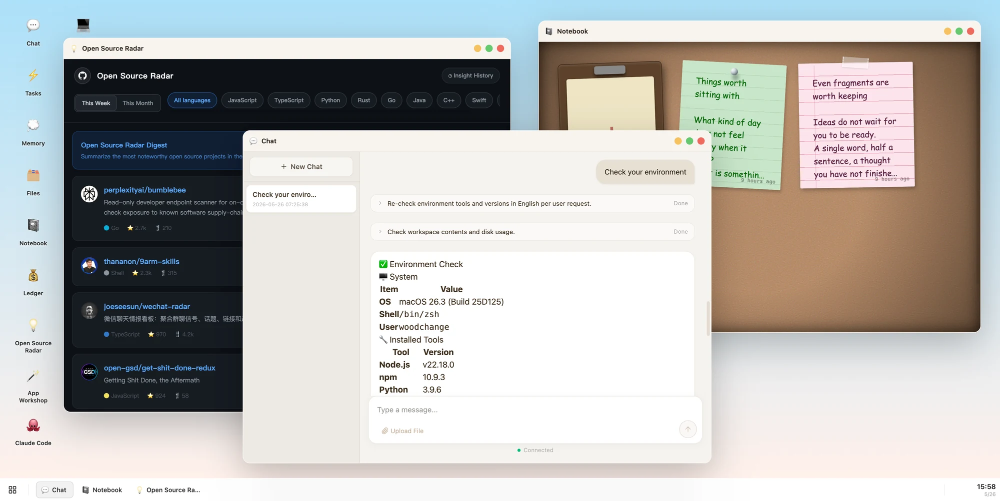
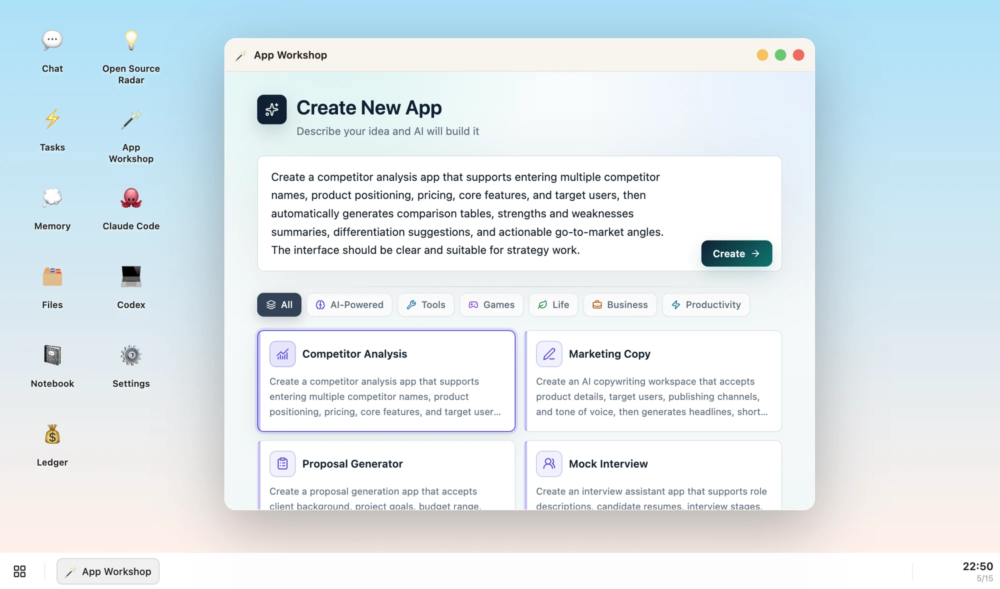
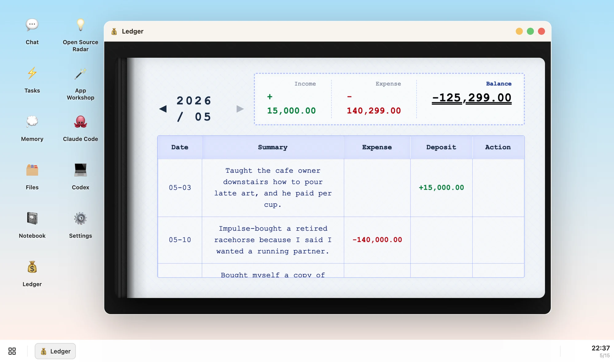
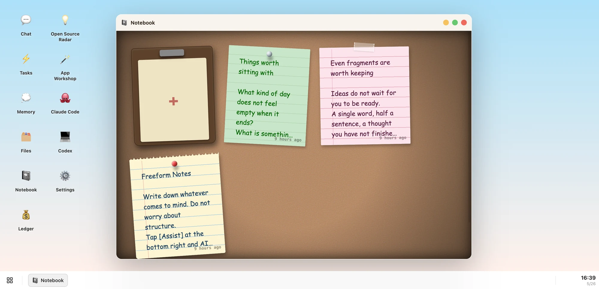
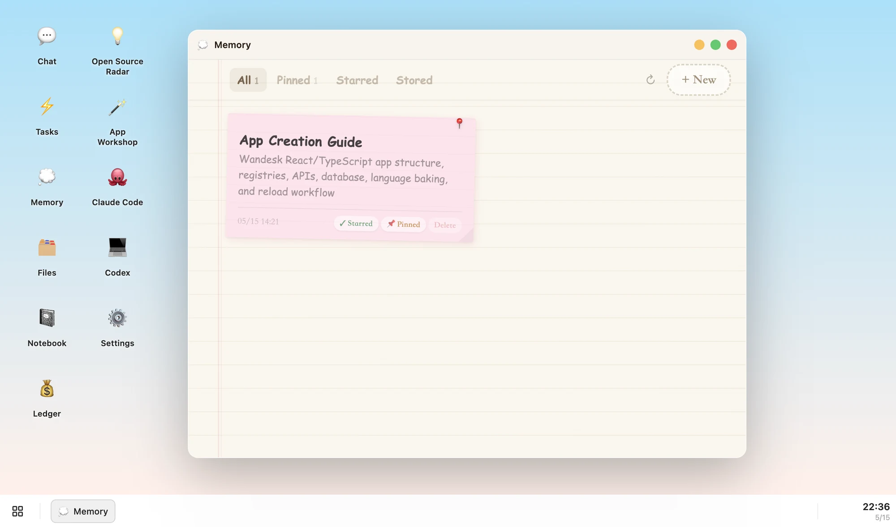
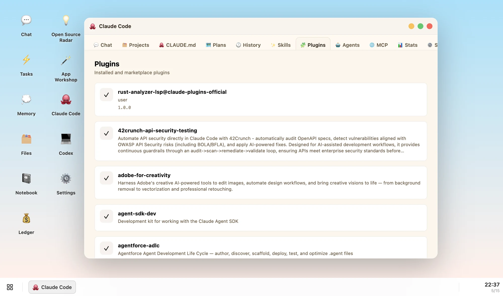

<div align="center">

# Wandesk

**赋予智能形状,让 AI 塑造你的桌面。**

一个开源的 AI 桌面 —— 说一句话就能造出你要的应用。接入 Claude Code、Codex、DeepSeek、OpenAI、Kimi、Qwen,以及任何 OpenAI 兼容模型。应用之间共享上下文,AI 记得你。全部本地,无需注册。

[官网](https://wandesk.ai) · [English](README.md) · [Discord](https://discord.gg/VUfTzCvz)



</div>

---

## 🚀 安装

> 前置要求:Git、Node.js 20+ 和 npm。

**macOS**

```bash
curl -fsSL https://raw.githubusercontent.com/Sider-ai/wandesk/main/install-macos.sh | sh
```

**Linux**

```bash
curl -fsSL https://raw.githubusercontent.com/Sider-ai/wandesk/main/install-linux.sh | sh
```

**Windows PowerShell**

```powershell
powershell -ExecutionPolicy Bypass -Command "irm https://raw.githubusercontent.com/Sider-ai/wandesk/main/install-windows.ps1 | iex"
```

安装完成后,打开 <http://localhost:9502>。

> 想要打包好的桌面应用版,不用跑 `localhost`?到 **[wandesk.cn](https://wandesk.cn)** 下载 macOS / Windows 安装包。

---

## ✨ Wandesk 能给你什么

不是一个更聪明的聊天框。是一台 AI 真正能在里面生活和工作的桌面。

### 💬 聊天 + 应用 —— 你真正的 AI 工作台

聊天框只是入口,真正的工作发生在应用里。笔记本、账本、看板、互动小说,每一个都为长期使用而生。

- 聊天、笔记本、账本可以同屏并行 —— 不会被压成一条对话流。
- Notebook、Ledger、Chat、Memory、Open Source Radar 开箱即用。
- 所有应用界面风格一致,学一次就会。
- 笔记就在笔记本里,账本就在账本里,不会被对话埋掉。


### 🪄 App Workshop —— 说一句话,就有一个应用

不会写代码也能拥有专属软件。描述你想要的功能,Wandesk 帮你生成完整的本地应用 —— UI、后端、数据库一次到位。

- React 界面 + 后端 API + SQLite 存储,一次生成。
- 完全本地运行,不依赖云,关掉网络也能用。
- 用着不顺手?继续跟 AI 说,它接着改。
- 没有订阅、没有广告、没有云端账号锁定。



### ⚙️ 每一个应用,都能调用 AI

不只是 AI 在外面帮你 —— 每个 Wandesk 应用本身都可以发起 AI 任务。

- 账本自动归类消费、生成月报。
- 笔记本一句话出周报。
- 互动小说自动续写,主动查询历史设定,保持人物一致性。
- App Workshop 生成的应用,天生具备 AI 调用能力。



### 🧠 上下文贯通 —— 你刚说的,应用已经知道

所有应用共享同一个 Agent 内核、同一个工作区。

- 切到任何一个应用说"把刚才的记下来",它知道你说的是什么。
- 不需要剪贴板、不需要 Zapier、不需要 MCP 桥接。
- 意图 → AI → 应用,中间没有复制粘贴。



### 📌 记忆沉淀 —— 用得越多,越懂你

Wandesk 会主动记住你的偏好、技能和纠错。

- *"我用 Swift + SwiftUI"* —— 一次告知,长期生效。
- 纠正过的错误,AI 下次不再犯。
- 常做的事可以打包成可复用的 **Skill**。
- 所有记忆都可见,不是黑盒。



### 🤝 Claude Code、Codex —— 都在你的桌面里

你常用的 AI 编程工具,直接成为 Wandesk 的应用。不切窗口、不复制粘贴,所有 agent 协作在一个地方完成。

- 装过 `claude` 或 `codex` CLI,Wandesk 自动挂成桌面应用。
- 外部 agent 也能原生操作 Wandesk —— 把一个链接发给它,它就能读懂整个桌面。
- 在真实代码、真实仓库里改文件,不是模拟。



---

## 🔌 接入你正在用的模型

Wandesk 跟具体模型供应商无关。任何你已经在用的 AI 都能接进来:

- **DeepSeek**
- **OpenAI**
- **Anthropic / Claude**
- **Google Gemini**
- **Kimi(月之暗面)**
- **Qwen(通义千问)**
- 任何 OpenAI 兼容端点

每个应用可以独立配置模型供应商,在 Wandesk 内部 Settings 里切换。

---

## 🧩 内置应用

| 应用 | 用途 |
|---|---|
| **Chat** | 意图层 —— 跟 AI 对话,带完整桌面上下文 |
| **App Workshop** | 描述一个应用想法,生成真实的本地应用 |
| **Tasks** | 跟踪桌面上正在进行的 agent 任务 |
| **Notebook** | 轻量笔记,AI 可读可写 |
| **Files** | 浏览和操作本地工作区文件 |
| **Memory** | 查看和编辑个人长期记忆 |
| **Settings** | 模型、供应商、语言、主题 |
| **Claude Code** | Anthropic 的代码工作台,作为桌面应用 |
| **Codex** | OpenAI Codex 工作台,同样的形态 |
| **Ledger** | 个人账本,AI 自动归类 |
| **Open Source Radar** | 追踪和分析 GitHub 热门项目 |

---

## 🏗️ 架构

```text
gui/                React 桌面 UI(窗口、任务栏、启动器、应用)
server/main/        核心 HTTP / WebSocket API 与系统服务
server/apps/        应用专属后端模块
server/shared/      共享后端工具
apps/               烘培生成的 APP.md 上下文文件
language/           UI 文案、提示词和应用文档的语言源
scripts/            开发与语言烘培脚本
skills/             内置 Codex skills
docs/               文档与图片
```

生成产物和运行时数据**不是源码** —— 别提交进 git:

```text
.aios/            运行时语言和配置状态
database/         SQLite 应用数据
files/            用户文件
gui/dist/         前端构建产物
node_modules/
```

---

## 🧱 技术栈

- **前端**:React 19、TypeScript、Vite、Tailwind CSS
- **后端**:Node.js HTTP API + WebSocket 运行时通道
- **存储**:SQLite(`better-sqlite3`)
- **运行端口**:主端 `9501`,应用端 `9502`
- **工作区数据**:`~/Library/Application Support/com.vidline.aios.wandesk.client/workspace`(macOS;Linux / Windows 在对应位置)

---

## 🛠️ 开发

```bash
npm install
npm run dev          # 英文 locale 开发
npm run dev:zh       # 中文 locale 开发
npm run typecheck
```

构建前端产物:

```bash
npm run build
npm run build:zh
```

### 语言烘培

Wandesk 的源文件在 `language/<locale>/`,烘培成运行时工作区:

```bash
tsx scripts/start.ts en --force
tsx scripts/start.ts zh --force
```

会重新生成 `apps/` 下的运行时应用文档和 `.aios/` 下的语言状态。

---

## 🌐 社区

- **官网**:<https://wandesk.ai>
- **中文站**:<https://wandesk.cn>
- **Discord**:<https://discord.gg/VUfTzCvz>
- **Issues**:<https://github.com/Sider-ai/wandesk/issues>

欢迎 PR、bug 报告、应用想法、语言贡献和 Skill 提交。大改动请先开 issue 聊一下方向。

---

## 🔗 相关项目

- [realuckyang/AIOS](https://github.com/realuckyang/AIOS) —— AI 时代操作系统的早期探索。

---

## 📄 许可证

ISC

---

<div align="center">

为想要亲手长出自己 AI 桌面的人而做。

</div>
